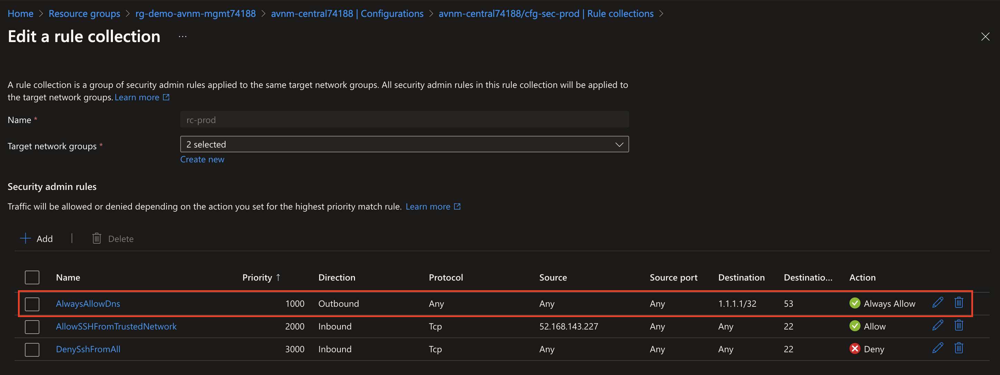

## Introduction

Organizations adopting Microsoft Azure strive for a balance between providing application teams with the freedom to innovate and maintaining the security posture of the organization. [Azure Virtual Network Manager (AVNM)](https://learn.microsoft.com/en-us/azure/virtual-network-manager/overview) provides the [Security Admin Rule](https://learn.microsoft.com/en-us/azure/virtual-network-manager/concept-security-admins) feature to help with achieving that goal. The feature allows organizations to centrally control the network security of their virtual networks at scale within their Azure estate.

Before we dive into how Security Admin Rules work, let's first do a refresher of the basics of AVNM.

## Azure Virtual Network Manager Foundations

An Azure Virtual Network Manager (Network Manager) instance is deployed to a region. The scope of management of a Network Manager is determined by a combination of its resource scope and its functional scope. 

The resource scope represents the subscription or subscriptions a Network Manager can manage. Resource scopes can include management groups to manage groups of subscriptions or individual subscriptions. Only one Network Manager can manage a specific scope at one time. The image below provides an example of how an organization could configure the resource scopes of Network Manager.

The functional scope determines which types of configurations the Network Manager will support. There are two scopes for management of virtual networks which include Connectivity and SecurityAdmin. [Connectivity Configurations](https://learn.microsoft.com/en-us/azure/virtual-network-manager/concept-connectivity-configuration) are used to manage the desired state of the connectivity and [SecurityAdmin Configurations](https://learn.microsoft.com/en-us/azure/virtual-network-manager/concept-security-admins) are used to manage Security Rules for the virtual networks within the resource scope. Configurations are deployed to one or more Azure regions.

Virtual networks that are within the resource scope of the Network Manager can be grouped into a logical grouping referred to as a [Network Group](https://learn.microsoft.com/en-us/azure/virtual-network-manager/concept-network-groups). Network Groups contain one or more virtual networks within the scope of a Network Manager and are associated to Connectivity and SecurityAdmin Configurations. Virtual networks are added to Network Groups manually or dynamically. When added dynamically through [the use of Azure Policy](https://learn.microsoft.com/en-us/azure/virtual-network-manager/concept-azure-policy-integration) these virtual network can be secured by default by being associated to a SecurityAdmin Configuration as they are provisioned. Connectivity and SecurityAdmin Configurations are only applied to virtual networks which are both within the resource scope and are a member of a Network Group that is associated with a configuration.

A SecurityAdmin Configuration contains one or more security admin rule collections. Each rule collection contains one more more security admin rules. Network Groups are associated to one or more rule collections which [apply the security rules to those virtual networks](https://learn.microsoft.com/en-us/azure/virtual-network-manager/concept-enforcement).

Security Admin Rules similar to security rules in Network Security Groups in that can filter inbound or outbound traffic based on the 5-Tuple information.  Security Admin Rules differ in that they support the AlwaysAllow action in addition to Allow or Deny. We will observe each of these actions later in this blog.

## How Security Admin Rules Work

Now that you understand the foundational components of AVNM, let's dive into how Security Admin Rules.

The key benefit to Security Admin Rules is they are processed before the rules within a Network Security Group. This provides an organization with the ability to establish a core set of "guardrail" rules while giving application teams freedom to configure Network Security Groups to their own requirements.

The visual below illustrates how Security Admin Rules work with Network Security Group security rules. If a rule uses the Allow action, the traffic is only allowed if the Network Security Group also allows the traffic. When a rule uses a Deny action, the traffic is denied at the Security Admin Rule even if the Network Security Group allows the traffic. Rules using the AlwaysAllow action will allow the traffic even if the Network Security Group denies the traffic.

Before we see the rules in action, let's cover some practical use cases based upon the Security Admin Rule action.

* Deny
    * Protect high-risk ports **by default** for all new and existing virtual networks.
* AlwaysAllow
    * Ensure critical infrastructure services traffic such as DNS and Windows Active Directory is always allowed.
    * Ensure security services traffic such as SIEM or endpoint security services is allowed.
* Allow
    * Allow traffic from trusted boundaries by default unless denied by an application team in a Network Security Group.
    * Use in combination with denies to limit the scope of sources an application team can allow in a Network Security Group. 

Let's take a look at Security Admin Rules in action.

## AlwaysAllow Demonstration
In this scenario the organization wants to ensure DNS traffic cannot be mistakenly blocked by application teams. 

Here we can observe the Network Security Group applied the virtual machine's subnet is denying outbound DNS traffic to the DNS service.

Performing a DNS lookup on the virtual machine using the DNS service shows a timeout as expected showing the Network Security Group security rule is currently in effect.

We now will deploy an AVNM Security Configuration to the virtual machine's region that contains a SecurityAdmin Rule Collection that has been associated to the Network Group the virtual machine's virtual network is a member of. This rule collection includes an AlwaysAllow rule for this traffic flow.

After the security configuration is applied, performing another DNS lookup to the DNS service comes back successful showing that the AlwaysAllow action supercedes Network Security Group rules.

## Deny Demonstration
In this scenario the organization wants to block HTTP traffic to virtual networks containing workloads which hold sensitive data. The organization has created a Security Admin Rule 

