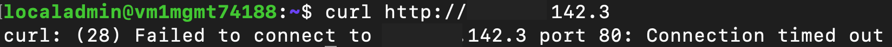

## Introduction

Organizations adopting Microsoft Azure strive for a balance between providing application teams with the freedom to innovate and maintaining the security posture of the organization. [Azure Virtual Network Manager (AVNM)](https://learn.microsoft.com/en-us/azure/virtual-network-manager/overview) provides the [Security Admin Rule](https://learn.microsoft.com/en-us/azure/virtual-network-manager/concept-security-admins) feature to help with achieving that goal. The feature allows organizations to centrally control the network security of their virtual networks at scale within their Azure estate.

Before we dive into how Security Admin Rules work, let's first do a refresher of the basics of AVNM.

## Azure Virtual Network Manager Foundations

An Azure Virtual Network Manager (Network Manager) instance is deployed to a region. The scope of management of a Network Manager is determined by a combination of its resource scope and its functional scope. 

The resource scope represents the subscription or subscriptions a Network Manager can manage. Resource scopes can include management groups to manage groups of subscriptions or individual subscriptions. Only one Network Manager can manage a specific scope at one time. The image below provides an example of how an organization could configure the resource scopes of Network Manager.

The functional scope determines which types of configurations the Network Manager will support. There are two scopes for management of virtual networks which include Connectivity and SecurityAdmin. [Connectivity Configurations](https://learn.microsoft.com/en-us/azure/virtual-network-manager/concept-connectivity-configuration) are used to manage the desired state of the connectivity and [SecurityAdmin Configurations](https://learn.microsoft.com/en-us/azure/virtual-network-manager/concept-security-admins) are used to manage Security Rules for the virtual networks within the resource scope. Configurations are deployed to one or more Azure regions.

Virtual networks that are within the resource scope of the Network Manager can be grouped into a logical grouping referred to as a [Network Group](https://learn.microsoft.com/en-us/azure/virtual-network-manager/concept-network-groups). Network Groups contain one or more virtual networks within the scope of a Network Manager and are associated to Connectivity and SecurityAdmin Configurations. Virtual networks are added to Network Groups manually or dynamically. When added dynamically through [the use of Azure Policy](https://learn.microsoft.com/en-us/azure/virtual-network-manager/concept-azure-policy-integration) these virtual network can be secured by default by being associated to a SecurityAdmin Configuration as they are provisioned. Connectivity and SecurityAdmin Configurations are only applied to virtual networks which are both within the resource scope and are a member of a Network Group that is associated with a configuration.

A SecurityAdmin Configuration contains one or more security admin rule collections. Each rule collection contains one more more security admin rules. Network Groups are associated to one or more rule collections which [apply the security rules to those virtual networks](https://learn.microsoft.com/en-us/azure/virtual-network-manager/concept-enforcement).

Security Admin Rules similar to security rules in Network Security Groups in that can filter inbound or outbound traffic based on the 5-Tuple information.  Security Admin Rules differ in that they support the AlwaysAllow action in addition to Allow or Deny. We will observe each of these actions later in this blog.

## How Security Admin Rules Work

Now that you understand the foundational components of AVNM, let's dive into how Security Admin Rules.

The key benefit to Security Admin Rules is they are processed before the rules within a Network Security Group. This provides an organization with the ability to establish a core set of "guardrail" rules while giving application teams freedom to configure Network Security Groups to their own requirements.

The visual below illustrates how Security Admin Rules work with Network Security Group security rules. If a rule uses the Allow action, the traffic is only allowed if the Network Security Group also allows the traffic. When a rule uses a Deny action, the traffic is denied at the Security Admin Rule even if the Network Security Group allows the traffic. Rules using the AlwaysAllow action will allow the traffic even if the Network Security Group denies the traffic.

Before we see the rules in action, let's cover some practical use cases based upon the Security Admin Rule actions.

* Deny
    * Protect high-risk ports **by default** for all new and existing virtual networks.
* AlwaysAllow
    * Ensure critical infrastructure services traffic such as DNS and Windows Active Directory is always allowed.
    * Ensure security services traffic such as SIEM or endpoint security services is allowed.
* Allow
    * Allow traffic from trusted boundaries by default unless denied by an application team in a Network Security Group.
    * Use in combination with denies to limit the scope of sources an application team can allow in a Network Security Group. 

Let's take a look at Security Admin Rules in action.

## AlwaysAllow Demonstration
In this scenario the organization's Central IT team must ensure that network traffic to critical infrastructure services cannot be mistakenly blocked by a misconfiguration. DNS is considered a critical infrastructure service for the organization and is provided by a 3rd-party DNS service hosted at 1.1.1.1. Let's look at how a security admin rule could help satisify this requirement.

The network security group configured by an application team has been configured to block DNS traffic to the organization's preferred DNS service as seen in the image below.

When a DNS lookup is performed on the virtual machine directed to the DNS service the request times out due to it being blocked by the security rule configured in the network security group.

The Central IT team creates an instance of Azure Virtual Network Manager and sets is resource scope to a management group which all of the application team subscriptions are children of. It then creates a new SecurityAdmin Configuration and adds a rule collection. The rule collection is associated with a network group that uses Azure Policy to manage the dynamic membership of the group based upon virtual networks containing the tag of environment=prod. Contained in this rule collection is a security admin rule which uses the Always Allow action to allow outbound DNS traffic destined to the organization's DNS service. 

The Central IT team then deploys the new SecurityAdmin Configuration to the Azure relevant Azure regions. The virtual network which include the production tag will be onboarded into the production network group at the next Azure Policy enforcement. When completed, another test is performed showing that the DNS traffic is now allowed to the 3rd-party DNS service. 

## Deny Demonstration
In this scenario the organization has a requirement to ensure all web-based communication with production workloads that store or process sensitive data is encrypted. Production workloads that do not store or process sensitive data do not have the requirement and it should be enforced on those workloads. Let's take a look at how we can use multiple rule collections and network groups to assign security admin rules to a subset of machines. 

A network security group has been configured by the application team to allow HTTP to a production workload storing sensitive data.

Performing a curl on the virtual machine from another endpoint returns the Hello World web page indicating the traffic is being allowed by the network security group.

The Central IT team does not need to create another SecurityAdmin Configuration to satisfy this requirement. Instead, it uses the existing SecurityAdmin Configuration and creates a new rule collection that will block this encrypted network flow. The rule collection is associated with a new network group that uses Azure Policy to manage the dynamic membership of the group based upon the virtual networks containing the tag of environment=production and classification=sensitive. Contained in the rule collection is a security admin rule which uses the Deny action to block HTTP traffic. This new rule collection will only target production machines that contain the additional tag indicating it stores or processes sensitive data.

The Central IT team then re-deploys the modified SecurityAdmin Configuration to the Azure relevant Azure regions. The application team's virtual network includes the matching classification tag and will be onboarded into the network group at the next Azure Policy enforcement.  When completed, inbound HTTP traffic to the sensitive virtual network is block. This demonstrates how an organization can block specific protocols by default to comply with the organization's security standards.

## Allow Demonstration
In this scenario the organization must ensure that SSH access to both production and non-production application team workloads is supported when coming from a trusted group of jump hosts but only if the application team requires it. Let's look at how an Allow and Deny security admin rule can be used in combination to allow for a traffic flow from a specific source while leaving it up to the application team to determine if that flow is required for their workload.

The Central IT team will the existing SecurityAdmin configuration and production rule collection created in the first scenario. Another rule collection will be created for non-production workloads and associated to a new network group. The new network group will use Azure Policy to manage the dynamic membership of the group based upon the virtual networks having the tag of environment=nonproduction. The existing production rule collection will be modified to include a new Allow and Deny security admin rules for incoming SSH traffic. The new non-production rule collection will contain the same Allow and Deny security admin rules.

The Central IT team then re-deploys the modified SecurityAdmin Configuration to the Azure relevant Azure regions. The application team's virtual network is tagged with an environment tag that has a value of production and has been onboarded into the production network group.  The newly added Allow and Deny security admin rules for SSH access will take effect.

The application team has determined that it does not want to support inbound SSH traffic for its production workload. It has configured its network security group to block all inbound traffic except for HTTP traffic as seen below.

Attempts to SSH to resources within the non-production virtual network is denied because the network security group security rule.

For non-production the application team would like to support SSH connections. However, they have allowed all sources. This is where the additional Deny security admin rule comes into play. This acts as a guardrail to restrict the machines that can SSH to the trusted jump servers.

SSH connections from the trusted jump hosts is allowed because both the security admin rules and network security groups allow the connection. Attempts any other source will be rejected because of the deny security admin rule.

## Multiple Azure Virtual Network Managers
In this scenario one of the organization's business units has requested an Azure Virtual Network Manager instance to use to manage their subscriptions. Central IT must maintain their instance and ensure it takes precedence.

Azure Virtual Network Manager supports multiple instances as long as those instances are applied at different scopes. In the scenario above, Central IT would set the resource scope of their instance high up in the management group structure while business unit would set their resource scope to their subscriptions. 

The architecture is pictured below.

The business unit builds an instance with a SecurityAdmin Configuration containing a rule collection that applies to a new network group that is local to the new instance for virtual networks running non-production workloads. The new network group will use Azure Policy to manage the dynamic membership of the group based upon the virtual networks having the tag of environment=nonproduction.

The rule collection contains a single rule that uses the always allow action to allow inbound SSH traffic from all sources. This rule conflicts with Central IT's rule which limits inbound SSH traffic to trusted jump servers. 

The application team deploys the SecurityAdmin Configuration to the relevant Azure regions. 

The application team attempts to SSH into one of their non-production virtual networks but the traffic is denied.

The connection fails because when multiple Azure Virtual Network Managers apply to a virtual network, and two security admin rules conflict, the rule from the highest scope applied. In this instance the Central IT instance is applied at a higher level management scope from the business unit instance and the rules limiting the source of SSH traffic take precedence.

