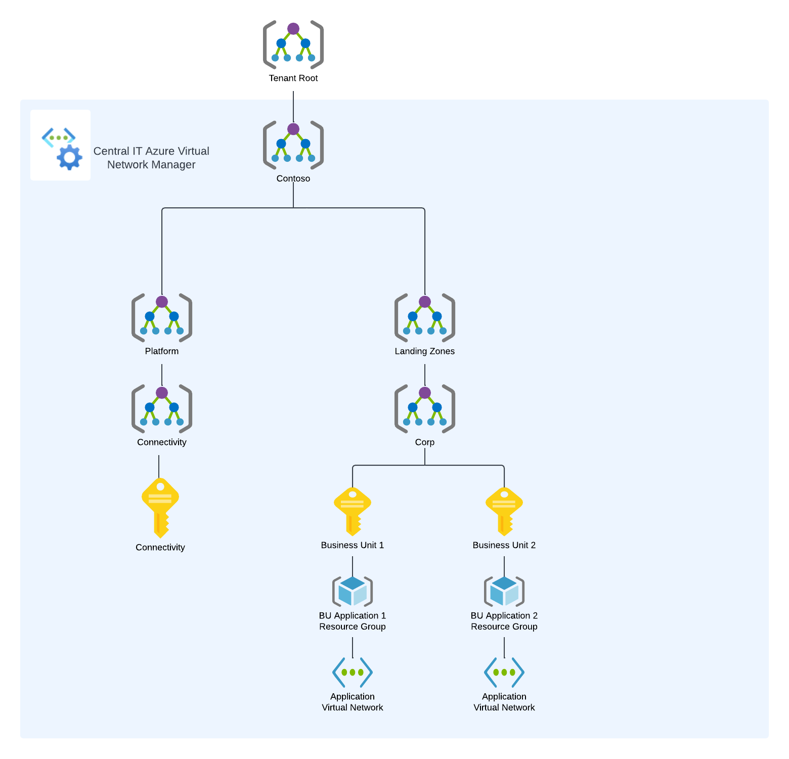
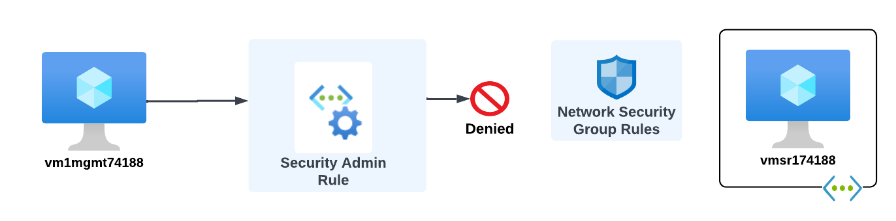
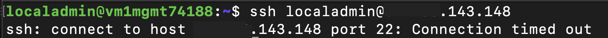

## Introduction

Organizations adopting Microsoft Azure strive for a balance between providing application teams with the freedom to innovate while maintaining the security posture of the organization. [Azure Virtual Network Manager](https://learn.microsoft.com/en-us/azure/virtual-network-manager/overview) provides [Security Admin Rules](https://learn.microsoft.com/en-us/azure/virtual-network-manager/concept-security-admins) to help with achieving that goal. Security Admin Rules allow an organization to centrally manage the network security of its virtual networks to maintain compliance with its policies while giving business units the option to manage the network security of their individual workloads.

Before we dive into how Security Admin Rules work, let's first do a refresher of the basics of Azure Virtual Network Manager.

## Azure Virtual Network Manager Foundations

An Azure Virtual Network Manager (Network Manager) instance is deployed to a region. The scope of management of a Network Manager is determined by a combination of its resource scope and its functional scope. 

The resource scope represents the subscription or subscriptions a Network Manager can manage. Resource scopes can include management groups to manage groups of subscriptions or it can be configured to manage individual subscriptions. Only one Network Manager can manage a specific scope at one time. The image below provides an example of how an organization could configure the resource scopes of Network Manager.



The functional scope determines which types of configurations the Network Manager will support. Today, there are two functional scopes for management of virtual networks which include Connectivity and SecurityAdmin. [Connectivity Configurations](https://learn.microsoft.com/en-us/azure/virtual-network-manager/concept-connectivity-configuration) are used to manage the desired state of the connectivity and [SecurityAdmin Configurations](https://learn.microsoft.com/en-us/azure/virtual-network-manager/concept-security-admins) are used to manage the network security of virtual networks across an organization's Azure estate.

Virtual networks that are within the resource scope of the Network Manager can be added into a logical grouping referred to as a [Network Group](https://learn.microsoft.com/en-us/azure/virtual-network-manager/concept-network-groups). Network Groups contain one or more virtual networks and are used apply a Connectivity or Security Admin Configuration to a set of virtual networks. Virtual networks are added to Network Groups manually or dynamically. When added dynamically through [the use of Azure Policy](https://learn.microsoft.com/en-us/azure/virtual-network-manager/concept-azure-policy-integration) these virtual network can be dynamically connected or security by default as they are provisioned. Connectivity and SecurityAdmin Configurations are only applied to virtual networks which are both within the resource scope and are a member of a Network Group that is associated with a configuration.

A Connectivity Configuration enforces either a mesh or hub and spoke network topology across one or more Network Groups. In a mesh topology, all virtual networks are connected to each other. In a hub and spoke topology, all virtual networks are connected as spokes to a hub virtual network and can optionally be connected with each other.

A SecurityAdmin Configuration contains one or more security admin rule collections. Each rule collection contains one more more security admin rules. Network Groups are associated to one or more rule collections which [apply the security admin rules the virtual networks](https://learn.microsoft.com/en-us/azure/virtual-network-manager/concept-enforcement).

Security Admin Rules similar to Network Security Group security rules in they operate at layer 4 of the OSI model and support 5-tuple rules.  Security Admin Rules differ in that they support the AlwaysAllow action in addition to Allow or Deny. I will demonstrate a variety of scenarios using Security Admin Rules in this blog.

In order for a configuration to be applied to the virtual networks the configuration must be deployed to the region the virtual networks is in. Per Network Manager instance, a single Security Admin Configuration and multiple Connectivity Configurations can be deployed per region.


## Security Admin Rules and Network Security Groups
The key benefit to Security Admin Rules is they are processed before the rules within a Network Security Group. This provides an organization with the ability to establish a core set of "guardrail" rules while giving application teams freedom to configure Network Security Groups to their own requirements.

The visual below illustrates how Security Admin Rules work with Network Security Group security rules. If a rule uses the Allow action, the traffic is only allowed if the Network Security Group also allows the traffic. When a rule uses a Deny action, the traffic is denied at the Security Admin Rule even if the Network Security Group allows the traffic. Rules using the AlwaysAllow action will allow the traffic even if the Network Security Group denies the traffic.


Practice use cases include:

* Protecting high-risk ports **by default** for all new and existing virtual networks.
* Ensuring critical infrastructure services traffic such as DNS and Windows Active Directory can't be mistakenly blocked.
* Ensuring security signals from applications and virtual machines cannot be blocked when being delived to a security information and event management (SIEM) solution.
* Providing support for SSH and RDP traffic to application teams while limiting the source of that traffic to a secure enclave of jump servers.
* Allowing traffic from trusted boundaries by default unless the application teams denies it.
 
## Lab Environment
For the demonstrations included in this blog post the lab environment below was utilized. The virtual network named vnetmgmt74188 contains two virtual machines. TThe machine named vm1mgmt74188 emulated a trusted machine and the other machine named vm2mgmt74188 emulated an untrusted machine. 

The other three virtual networks emulated application team virtual networks. The network named vnets-r174188 emulated a virtual network with a workload storing or processing sensitive data, vnetp-r174188 emulated a production virtual network, and vnetnp-r174188 emulated a non-production virtual network. 

Each virtual network contained a single virtual machine running a web server which was secured by a Network Security Group associated to the subnet.


## AlwaysAllow Demonstration
In this scenario the organization's Central IT team must ensure that network traffic from production workloads to critical infrastructure services cannot be mistakenly blocked by a misconfiguration of a Network Security Group. DNS is considered a critical infrastructure service for the organization and is provided by a 3rd-party DNS service hosted at 1.1.1.1. 

The scenario goal is pictured below:


The Network Security Group configured by an application team has mistakenly been configured to block DNS traffic to the organization's preferred DNS service as seen in the image below.


When a DNS lookup is performed on the production virtual machine directed to the DNS service the request times out due to it being blocked by the security rule configured in the Network Security Group.


The Central IT team creates an instance of Azure Virtual Network Manager and sets is resource scope to a management group which all of the application team subscriptions are children of. It then creates a new SecurityAdmin Configuration and adds a rule collection. The rule collection is associated with a network group that uses Azure Policy to manage the dynamic membership of the group based upon virtual networks containing the tag of environment=prod. Contained in this rule collection is a security admin rule which uses the Always Allow action to allow outbound DNS traffic destined to the organization's DNS service. 


The Central IT team creates a new Azure Policy definition which applies to any virtual networks with the tag of environment=production. The Azure Policy is assigned to the same management group the Network Manager is scoped to.

```
    "policyRule": {
      "if": {
        "allOf": [
          {
            "field": "type",
            "equals": "Microsoft.Network/virtualNetworks"
          },
          {
            "allOf": [
              {
                "field": "tags['environment']",
                "equals": "production"
              }
            ]
          }
        ]
      },
      "then": {
        "effect": "addToNetworkGroup",
        "details": {
          "networkGroupId": "/subscriptions/XXXXXXXX-XXXX-XXXX-XXXX-XXXXXXXXXXXX/resourceGroups/rg-demo-avnm-mgmt74188/providers/Microsoft.Network/networkManagers/avnm-central74188/networkGroups/ng-prod"
        }
      }
    }
```

After Azure Policy is assigned and policy evaluation takes place the production virtual network is dynamically added into the Network Group.


The Central IT team deploys the SecurityAdmin Configuration to the Azure region. A short time later, DNS queries to the organization's DNS service running at 1.1.1.1 are successful demonstrating the SecurityAdmin Rule with the AlwaysAllow action is allowing the traffic.


## Deny Demonstration
In this scenario the organization has a requirement to ensure all web-based communication with production workloads that store or process sensitive data is encrypted. Production workloads that do not store or process sensitive data do not have the requirement and it should not be enforced on those workloads. 

The scenario goal is pictured below.



A Network Security Group has been configured by the application team to allow HTTP to a production workload storing sensitive data which does not align with the organization's security policy.


Performing a curl on the virtual machine from one of the demonstration machines successfully returns the Hello World webpage indicating the Network Security Group is allowing HTTP traffic.


The Central IT team does not need to create another SecurityAdmin Configuration to satisfy this requirement. Instead, it uses the existing SecurityAdmin Configuration and creates a new Rule Collection that will block this unencrypted network flow. It is associated with a Network Group that uses Azure Policy to manage the dynamic membership of the group based upon virtual networks containing the tag of environment=production and classification=sensitive. Contained in the Rule Collection is a Security Admin Rule which uses the Deny action to block HTTP traffic.


The Central IT team creates a new Azure Policy definition which applies to any virtual networks with the tag of environment=production and classification=sensitive. The Azure Policy is assigned to the same management group the Network Manager is scoped to.

```
    "policyRule": {
      "if": {
        "allOf": [
          {
            "field": "type",
            "equals": "Microsoft.Network/virtualNetworks"
          },
          {
            "allOf": [
              {
                "field": "tags['environment']",
                "equals": "production"
              },
              {
                "field": "tags['classification']",
                "equals": "sensitive"
              }
            ]
          }
        ]
      },
      "then": {
        "effect": "addToNetworkGroup",
        "details": {
          "networkGroupId": "/subscriptions/XXXXXXXX-XXXX-XXXX-XXXX-XXXXXXXXXXXX/resourceGroups/rg-demo-avnm-mgmt74188/providers/Microsoft.Network/networkManagers/avnm-central74188/networkGroups/ng-sensitive"
        }
      }
    }
```

After Azure Policy is assigned and policy evaluation takes place the production virtual network containing sensitive workloads is dynamically added into the Network Group.


The Central IT team re-deploys the SecurityAdmin Configuration to the Azure region. A short time later, HTTP requests from curl from the demonstration virtual machine times out because the connection is blocked demonstrating the Security Admin Rule with the Deny action blocks the traffic.


## Allow Demonstration
In this scenario the organization must ensure that remote access to both production and non-production workloads is supported, but only when coming from a trusted enclave of jump servers. The Central IT team should allow application teams to determine if this type of access is needed for their workload. The application team has determined that this traffic is not required for their Production Workload A, but should be supported for their Non-Production Workload B.

The scenario goals are pictured below.


The Central IT team can use the existing SecurityAdmin Configuration to satisfy these requirementes. It will add additional rules to the existing production Rule Collection. A Security Admin Rule with the Allow action will allow SSH traffic from the trusted security enclave while a lower priority rule will deny SSH from all sources. A new Rule Collection for non-production will be created and associated to a new Network Group that uses Azure Policy to manage the dynamic membership of the group based upon virtual networks containing the tag of environment=nonproduction. This Rule Collection will contain the same two new rules as the production Rule Collection.


The Central IT team creates a new Azure Policy definition which applies to any virtual networks with the tag of environment=nonproduction. The Azure Policy is assigned to the same management group the Network Manager is scoped to.

```
    "policyRule": {
      "if": {
        "allOf": [
          {
            "field": "type",
            "equals": "Microsoft.Network/virtualNetworks"
          },
          {
            "allOf": [
              {
                "field": "tags['environment']",
                "equals": "nonproduction"
              }
            ]
          }
        ]
      },
      "then": {
        "effect": "addToNetworkGroup",
        "details": {
          "networkGroupId": "/subscriptions/XXXXXXXX-XXXX-XXXX-XXXX-XXXXXXXXXXXX/resourceGroups/rg-demo-avnm-mgmt74188/providers/Microsoft.Network/networkManagers/avnm-central74188/networkGroups/ng-nonprod"
        }
      }
    }
```

After Azure Policy is assigned and policy evaluation takes place the non-production virtual networks are dynamically added into the Network Group.


The Central IT team re-deploys the SecurityAdmin Configuration to the Azure region.

The application team configured the Network Security Group protecting Production Workload A to block all SSH traffic.


Attempts to SSH from a virtual machine in a trusted enclave to Production Workload A times out because it is denied by the Network Security Group. This demonstrates how the traffic must be allowed by both the Network Security Group and the Security Admin Rule when the Allow action is used.



The application team configured the Network Security Group protecting Non-Production Workload A to allow SSH traffic from all sources.


Attempts to SSH from an untrusted virtual machine to Non-Production Workload A times out because the untrusted virtual machine is not a source included in the Security Admin Rule with the allow action. It is instead matched to the lower priority Deny rule which causes the traffic to be blocked.


Attempts to SSH from a trusted virtual machine to Non-Production Workload A is successful because it matches the Security Admin Rule with the Allow action and is allowed by the Network Security Group.


## Multiple Azure Virtual Network Managers
In this scenario one of the organization's business units has requested an Azure Virtual Network Manager instance to use to manage their subscriptions. Central IT must maintain their instance to ensure compliance with organizational security policy.

Azure Virtual Network Manager supports multiple instances as long as those instances are applied at different scopes. In the scenario above, Central IT would set the resource scope of their instance higher up in the management group structure than where the business unit would assign its resource scope.

The architecture is pictured below.


The business unit builds an instance with a SecurityAdmin Configuration containing a Rule Collection that applies to a new Network Group in the Network Manager for virtual networks running non-production workloads. The Network Group will use Azure Policy to manage the dynamic membership of the group based upon the virtual networks having the tag of environment=nonproduction. The policy will use similar logic as to the policy seen earlier.

The Rule Collection contains a single Security Admin Rule has been mistakenly configured with the AlwaysAllow action to allow all inbound SSH traffic even if the Network Security Group is configured to block it.

The application team deploys the SecurityAdmin Configuration to the relevant Azure regions. 


An attacker attempts to SSH into a non-production workload from an untrusted machine. The traffic is denied and the attacker is prevented from establishing the session.


The connection fails because when multiple Azure Virtual Network Managers apply to a virtual network, and Security Admin Rules between the two instances conflict, the rule from the highest scope applied. In this scenario the Central IT instance is applied at a higher level management scope from the business unit instance so the traffic is blocked because the source of the traffic is an untrusted machine.

## Virtual Network Flow Logs and Azure Virtual Network Manager Security Admin Rules

Organizations frequently have the requirement to log when network traffic is allowed or denied to satisfy regulatory requirements and assist with troubleshooting in day-to-day operations. Traffic that is processed by an Azure Virtual Network Manager Security Admin Rule can be logged using VNet Flow Logs. VNet Flow Logs are a feature of Network Watcher and log information about the IP traffic coming in and out of a virtual network for supported workloads. This includes IP traffic processed by Network Security Groups and Security Admin Rules. It also supports evaluating the encryption status of network traffic if scenarios where virtual network encryption is used.

In this scenario we will explore how to use a VNet Flow Logs to determine if traffic is being blocked by a Security Admin Rule or Network Security Group.

VNet Flow Logs must be enabled on each virtual network. As of the date of this post, VNet Flow Logs are in Public Preview and available in a limited set of regions. You must [sign-up](https://aka.ms/VNetflowlogspreviewsignup) to use the feature. Once onboarded into the preview, the VNet Flow Log must be configured on the virtual network. The logs are delivered to an Azure Storage Account.

In the command below the production virtual network is enabled for VNet Flow Logs.

```
az network watcher flow-log create --location eastus --name flvnetp-r174188 --resource-group rg-demo-avnm-p74188 --vnet vnetp-r174188 --storage-account "/subscriptions/XXXXXXXX-XXXX-XXXX-XXXXXXXXXXXX/resourceGroups/rg-demo-avnm-mgmt74188/providers/Microsoft.Storage/storageAccounts/stlogsr174188"
```

After the VNet Flow Logs are enabled, An attempt is made to establish an SSH connection to a workload in the production virtual network from one of the jump hosts in the trusted enclave. The SSH connection times out because it is blocked by either a Security Admin Rule or Network Security Group. 

Let's explore how VNet Flow Logs can be used to determine which type of rule is blocking the traffic.


Within the Azure Storage Account a new container has been created named insights-logs-flowlogflowevent. This is the container where VNet Flow Logs are stored.


The latest VNet Flow Log is downloaded from the Azure Storage Account and reviewed. Searching for the jump server's IP identifies a flow record for the virtual network the workload is in and at the time the SSH connection was attempted. The aclId property indicates the resources that evaluated the flow. In this case we see that it is a Network Security Group named nsgp-pri-r169341. The rule property indicates the name of the security rule that evaluated the traffic which was named block-all. In the flowTuples array, the highlighted record indicates the SSH traffic from the trusted jump server was denied.


Let's look at another scenario where the application team is having issue doing load testing on their production application. 

The latest VNet Flow Log is again downloaded from the Azure Storage Account. A search for the IP addressed used by the load testing service identifies a flow record for the virtual network the workload is in at the time the testing was performed Here the aclId property indicates the Network Manager Security Configuration with a Rule Collected named rc-prod evaluated the traffic. The traffic from the load testing service was denied by a rule named DenyHttp.


